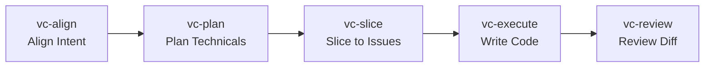
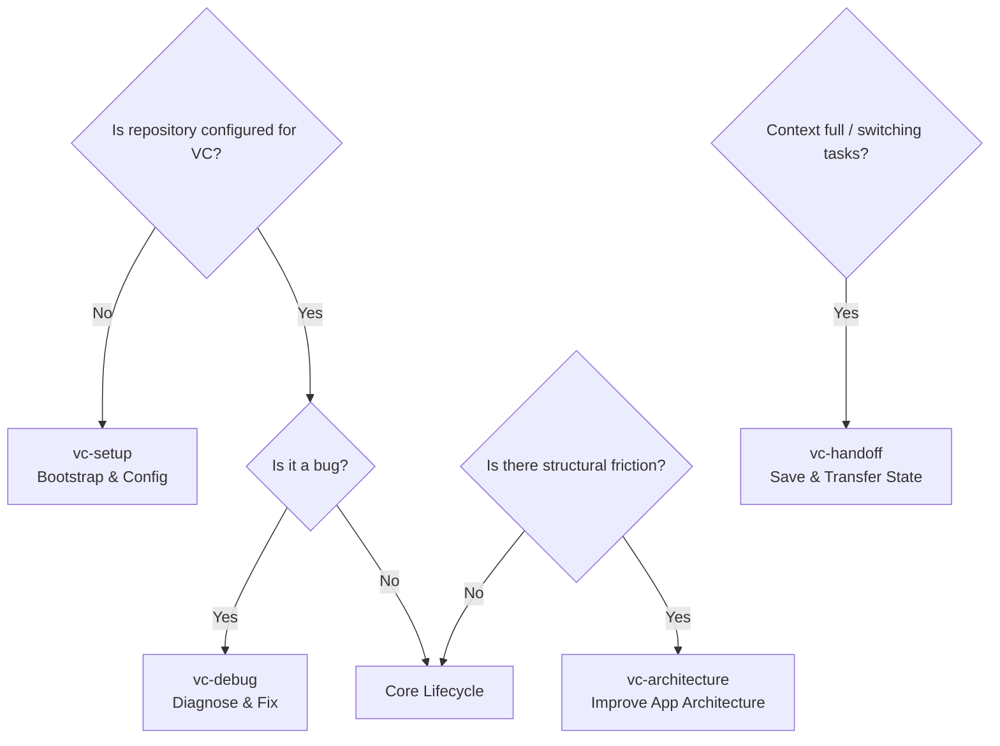

# Vector Cadence (VC) Skills: Lifecycle and Workflow Guide

This guide provides a detailed explanation of the core and auxiliary Vector Cadence (VC) skills, their operating models, and the exact order in which they should be used to ensure safe, structured, and efficient software engineering workflows.

---

## 1. Overview of the Core Lifecycle

Vector Cadence utilizes a structured, lifecycle-oriented engineering process. The core workflow progresses in a linear pipeline to move from fuzzy intent to verified, production-ready code:

### Why this specific order?
1. **Align before Planning (`vc-align` → `vc-plan`)**: You must agree on *what* to build (the user requirements, product boundaries, and rejected alternatives) before you write any technical design or research implementation files. This prevents waste.
2. **Plan before Slicing (`vc-plan` → `vc-slice`)**: You must define implementation units, file scopes, and test scenarios before you slice the work into trackable issues.
3. **Slice before Execution (`vc-slice` → `vc-execute`)**: Breaking down a plan into vertical slices ensures that implementation happens in small, testable, and independently shippable increments, rather than monolithic, risky blocks.
4. **Execute before Review (`vc-execute` → `vc-review`)**: Write code using behavior-driven TDD, and immediately feed the resulting implementation/diff into the review step to verify correctness and spec-completeness.

---

## 2. Core Skills Deep Dive

### 2.1 [vc-align](file:///c:/Users/mithi/Desktop/mithil/skills/skills/vc-align/SKILL.md) — Intent Alignment
*   **Purpose**: Clarify what should be built and why before planning. Turns fuzzy goals into shared domain understanding.
*   **When to Use**:
    *   New features or meaningful product/domain changes.
    *   Refactors with user-visible or architectural consequences.
    *   Ambiguous bug reports where expected behavior is unclear.
*   **When to Skip**:
    *   Obvious one-file edits, typos, and mechanical code modifications.
    *   Work that has an already-aligned and reviewed requirements document.
*   **Key Workflow**:
    1.  **Classify Depth**: Determine if the task is Lightweight, Standard, or Deep (high-risk areas like payments, security).
    2.  **Scan Context**: Search repo instructions, ADRs, glossary, and current code. *Never ask the user a question the repo can answer.*
    3.  **Pressure-test the Idea**: Probe gaps (specificity, durability, counterfactuals). Ask one question at a time.
    4.  **Explore Alternatives**: Present 2-3 concrete options (simplifications, complications, risks) and recommend one.
    5.  **Capture Decisions**: Document decisions in `docs/align-notes/` or requirements documents.
*   **Outputs & Outcomes**:
    *   **Chat Summary**: `## Alignment Summary` highlighting the intent, target user, success criteria, chosen approach, rejected alternatives, key risks, and recommended next skill (`vc-plan` | `vc-prototype` | `vc-debug`).
    *   **Artifacts / Code**: Requirements document (`docs/brainstorms/YYYY-MM-DD-<topic>-requirements.md`), alignment notes (`docs/align-notes/<slug>-grilled.md`) detailing rejected directions and assumptions, or glossary updates to `CONTEXT.md`.
*   **Guardrails**:
    *   Do not write implementation code.
    *   Do not publish tickets/issues.
    *   Capture messy guardrails and assumptions; don't hide them in clean bullet points.

### 2.2 [vc-plan](file:///c:/Users/mithi/Desktop/mithil/skills/skills/vc-plan/SKILL.md) — Technical Design
*   **Purpose**: Convert aligned intent into an implementation-ready technical plan without coding.
*   **When to Use**:
    *   Converting requirements/PRDs into concrete implementation strategies.
    *   Scoping refactors, integrations, or complex migrations.
*   **When to Skip**:
    *   Product scope is still unresolved (needs `vc-align` first).
    *   A bug lacks a verified root cause (needs `vc-debug` first).
    *   Trivial/safe changes.
*   **Key Workflow**:
    1.  **Classify Tier**: T1 (low-risk, local scan), T2 (moderate ambiguity, focused research), T3 (deep research for security/payments/core loop).
    2.  **Gather Context**: Analyze target modules, interfaces, and nearby tests.
    3.  **Write Implementation Units**: Create stable Unit IDs (e.g., `U1`). For each, specify goals, repo-relative file paths, high-level approaches (no code), test scenarios, and verification criteria.
    4.  **Check Slice-Readiness**: Mark units as vertical slices or preparatory tasks.
    5.  **Save the Plan**: Save to `docs/plans/`.
*   **Outputs & Outcomes**:
    *   **Chat Summary**: `## Plan Ready` detailing the plan file path, safety tier (T1/T2/T3), source artifacts, list of implementation units, high-risk areas, and recommended next skill (`vc-review` | `vc-slice` | `vc-execute`).
    *   **Artifacts / Code**: A formal markdown technical plan at `docs/plans/YYYY-MM-DD-NNN-<type>-<slug>-plan.md` or a unified knowledge document at `docs/knowledge/<slug>.md`.
*   **Guardrails**:
    *   Do not write code or shell choreography.
    *   Do not over-research low-risk work.
    *   Do not create horizontal layer units (e.g. splitting backend vs. frontend vs. tests).

### 2.3 [vc-slice](file:///c:/Users/mithi/Desktop/mithil/skills/skills/vc-slice/SKILL.md) — Issue Slicing
*   **Purpose**: Convert the technical plan into narrow, vertical, independently useful work items (tickets).
*   **When to Use**:
    *   Preparing a large plan for implementation (e.g. AFK agent execution).
    *   Breaking down PRDs/plans to prevent horizontal layer splits.
*   **When to Skip**:
    *   Single, small, self-contained tasks.
    *   The plan still needs unresolved technical decisions.
*   **Key Workflow**:
    1.  **Draft Vertical Slices**: Every slice must create a complete end-to-end path through the system that is demoable/verifiable.
    2.  **Reject Horizontal Leakage**: Avoid tickets like "build database schema" or "write API". Merge setup steps into the first vertical slice that requires them.
    3.  **Classify Execution Mode**: Mark slices as AFK (clear scope, known verification), HITL (needs human design/security input), or Manual.
    4.  **Publish**: Write issues to the tracker or save locally.
*   **Outputs & Outcomes**:
    *   **Chat Summary**: `## Slices Ready` outlining the created slices, AFK/HITL/Manual classifications, the blocked-first dependency, and recommended next skill (`vc-triage` | `vc-execute`).
    *   **Artifacts / Code**: Published tickets in the issue tracker (e.g., GitHub/Linear) or local markdown issues at `docs/issues/<slug>-<nn>.md` detailing acceptance criteria, test expectations, and agent briefs.
*   **Guardrails**:
    *   Do not publish without user approval unless in an explicit headless pipeline.
    *   Do not create layer tickets.
    *   Do not mark low-confidence work as AFK.

### 2.4 [vc-execute](file:///c:/Users/mithi/Desktop/mithil/skills/skills/vc-execute/SKILL.md) — Implementation
*   **Purpose**: Safely implement approved work and write tested code.
*   **When to Use**:
    *   Implementing a reviewed plan or executing a "ready-for-agent" issue.
    *   Running a bounded AFK implementation loop.
*   **When to Skip**:
    *   Scope is vague or design is unresolved (needs `vc-align` or `vc-plan`).
    *   Bug lacks root cause (needs `vc-debug`).
*   **Key Workflow**:
    1.  **Check Workspace Safety**: Use isolated feature branches or worktrees to avoid overwriting ongoing work.
    2.  **Build Task List**: Track progress of units/test scenarios in `task.md`.
    3.  **Test-Driven Development (TDD)**: Choose one behavior → write a failing public-interface test → implement minimal code → verify green → refactor while green → repeat.
    4.  **Verify Continuously**: Exercise the real integration chain, check side effects, and verify error boundaries.
    5.  **Apply Review Gate**: Run focused/broad tests according to safety tier before declaring completion.
*   **Outputs & Outcomes**:
    *   **Chat Summary**: `## Execution Summary` detailing the implemented work, source traces, tests run, applied review gate, commits made, outstanding risks, and recommended next skill (`vc-review` | `vc-learn`).
    *   **Artifacts / Code**: Fully implemented and tested code changes, green test cases, task progress tracker (`task.md`), and logical git commits on the feature branch.
*   **Guardrails**:
    *   Do not write code from vague requirements.
    *   Do not refactor while tests are red.
    *   Stop executing if 3 fix attempts fail or if you discover unplanned architectural decisions.

### 2.5 [vc-review](file:///c:/Users/mithi/Desktop/mithil/skills/skills/vc-review/SKILL.md) — Quality Gate
*   **Purpose**: Verify that implemented work is complete, correct, safe, and meets project standards.
*   **When to Use**:
    *   Pre-merge code reviews.
    *   Post-implementation verification gate.
    *   Validating plans or requirement docs.
*   **When to Skip**:
    *   Trivial changes with obvious validation.
    *   Active work-in-progress.
*   **Key Workflow**:
    1.  **Discover Intent**: Read the original issue, plan U-IDs, and requirements.
    2.  **Select Review Lenses**: Always check correctness, testing, maintainability, and requirements coverage. Layer in specialized reviews (security, performance, migrations) as needed.
    3.  **Run Read-Only Reviews**: Subagents used for review must be strictly read-only (no changes to branch, code, or stash).
    4.  **Present Verdict**: Output a clear verdict (Ready to merge, Ready with fixes, or Not ready) in a structured table.
*   **Outputs & Outcomes**:
    *   **Chat Summary**: `## Review Summary` presenting the scope, intent source, verdict, must-fix/should-fix findings, testing gaps, residual risks, and recommended next skill (`vc-execute` | `vc-debug` | `vc-learn`).
    *   **Artifacts / Code**: A structured findings table mapping bugs and improvements by severity (P0-P3), confidence, and action route (`safe_auto`, `gated_auto`, `manual`, `advisory`), along with a merge verdict.
*   **Guardrails**:
    *   Do not allow reviewer tools or subagents to mutate files.
    *   Do not flood findings with subjective taste opinions.
    *   Never silently drop explicit spec requirements.

---

## 3. "When Needed" (Contextual) Skills

These skills are invoked outside the standard linear lifecycle when specific situations arise.

### 3.1 [vc-debug](file:///c:/Users/mithi/Desktop/mithil/skills/skills/vc-debug/SKILL.md) — Bug Diagnosis
*   **Purpose**: Establish a reproduction loop and trace the exact causal chain of a bug before attempting a fix.
*   **When to Use**:
    *   Failing tests, stack traces, regressions, or user-reported bugs.
    *   Flaky or non-deterministic behavior.
    *   Repeated failed attempts to fix an issue.
*   **How it integrates with the core order**:
    *   If a bug is reported, skip `vc-align`/`vc-plan` and run `vc-debug` first.
    *   Once the diagnosis is clear (trigger → invalid state → symptom), use `vc-execute` to apply the fix, followed by `vc-review`.
    *   If the bug turns out to be a design issue, route from `vc-debug` to `vc-architecture` or `vc-plan`.
*   **Key Workflow**:
    1.  **Build a Reproduction Loop**: Create a fast, deterministic, runnable test or script that reproduces the bug.
    2.  **Verify Environment Sanity**: Rule out stale builds, incorrect branch states, and local config mismatches.
    3.  **Trace Code Path**: Follow variables backward from the failure point to where the state first becomes invalid.
    4.  **Causal-Chain Gate**: You *must not* apply a fix until you can map out the trigger, path, invalid state inception, and symptom.
    5.  **Fix Test-First**: Write a regression test that fails on the bug, apply the fix, check it goes green, and clean up temporary logs.
*   **Outputs & Outcomes**:
    *   **Chat Summary**: `## Debug Summary` clarifying the diagnosed problem, reproduction steps, proven root cause, causal chain, applied fix or diagnosis details, and recommended next skill (`vc-execute` | `vc-review` | `vc-architecture` | `vc-learn`).
    *   **Artifacts / Code**: A clean, repeatable unit or integration test reproducing the failure, a test-first regression fix (committed code), or a diagnostic report outlining the failure mechanism.
*   **Guardrails**:
    *   Do not fix without a reproduction loop or explaining the causal chain.
    *   Do not leave debug instrumentation behind.

### 3.2 [vc-architecture](file:///c:/Users/mithi/Desktop/mithil/skills/skills/vc-architecture/SKILL.md) — Application Architecture Refactoring
*   **Purpose**: Identify structural code friction and design deep modules/seams to improve codebase leverage and testability.
*   **When to Use**:
    *   Code is hard to unit-test or requires extensive mocking of internals.
    *   Duplicated invariants, tangled responsibilities, or shallow "pass-through" modules.
    *   Refactoring module boundaries.
*   **How it integrates with the core order**:
    *   Run `vc-architecture` when you notice structural friction during alignment (`vc-align`) or debugging (`vc-debug`).
    *   Once a clean candidate is chosen, feed it into `vc-plan` to design the compatibility/migration path, then `vc-slice` and `vc-execute` to perform the refactor.
*   **Key Workflow**:
    1.  **Find Friction**: Spot concepts spread across too many files, leaky interfaces, or lack of public seams.
    2.  **Present Candidates**: Propose alternative module shapes and describe the locality/leverage/testing improvements.
    3.  **Design Interfaces**: Create 2-3 different interface layouts, comparing complexity and testability.
    4.  **Plan Refactor Path**: Outline compatibility strategies, characterization tests, and vertical migration steps.
*   **Outputs & Outcomes**:
    *   **Chat Summary**: `## Architecture Summary` detailing the top structural findings, recommended direction, locality/leverage/testability rationale, risks, and recommended next skill (`vc-plan` | `vc-slice` | `vc-execute`).
    *   **Artifacts / Code**: Proposed interface signatures, component refactoring paths, and potential Architecture Decision Records (ADRs) or updates to `CONTEXT.md`.
*   **Guardrails**:
    *   Do not base architecture on personal taste alone; ground it in real friction.
    *   Do not create seams for hypothetical future use cases.
    *   Do not use this for the *agent/harness* architecture (use `vc-harness-architect` instead).

### 3.3 [vc-handoff](file:///c:/Users/mithi/Desktop/mithil/skills/skills/vc-handoff/SKILL.md) — State Handoff
*   **Purpose**: Compact and transfer the current workspace state so a fresh agent or human can resume work without reading the entire conversation history.
*   **When to Use**:
    *   The model context window is getting full.
    *   Switching between different agents or harness setups.
    *   Pausing work mid-session or leaving a debug/execution loop incomplete.
    *   Preparing a brief for a subagent.
*   **How it integrates with the core order**:
    *   Can be called at any point in the lifecycle when a pause, delegation, or reset is required.
*   **Key Workflow**:
    1.  **Gather State**: Summarize user goal, active branch, paths to updated plans/docs, decisions made, failed attempts, and the next recommended action.
    2.  **Redact**: Remove secrets, credentials, and sensitive private data.
    3.  **Write Handoff**: Default path is `docs/handoffs/`.
*   **Outputs & Outcomes**:
    *   **Chat Summary**: `## Handoff Ready` indicating the path/location of the handoff, the handoff type, next action, key risks, and recommended next skill.
    *   **Artifacts / Code**: A compacted state document at `docs/handoffs/YYYY-MM-DD-<slug>-handoff.md` or a structured chat summary containing goals, current state, decisions made, file diffs, and explicit next actions.
*   **Guardrails**:
    *   Do not duplicate large artifacts.
    *   Never output a vague handoff (e.g. "continue working"). Always end with a concrete, actionable next step.

### 3.4 [vc-setup](file:///c:/Users/mithi/Desktop/mithil/skills/skills/vc-setup/SKILL.md) — Workspace / Harness Setup
*   **Purpose**: Bootstrap and prepare a repository for Vector Cadence workflows, specifying where documentation lives, label mappings, and validation commands.
*   **When to Use**:
    *   First using Vector Cadence skills in a repository.
    *   Issue labels or docs structure are undefined.
    *   Validation commands (test/lint/typecheck) are missing or need configuration.
    *   Transitioning from ad-hoc agent interactions to structured workflows.
*   **When to Skip**:
    *   The repository is already properly configured for Vector Cadence.
    *   Performing a quick, simple, one-off edit where workspace metadata is not needed.
*   **Key Workflow**:
    1.  **Detect Environment**: Scan repo managers, CI config, package manager, and existing files (e.g., `AGENTS.md` / `CLAUDE.md`).
    2.  **Ask Setup Questions**: Query the user for unresolved details (e.g., Linear vs GitHub issue tracker, docs modes, budget parameters).
    3.  **Safely Update Rules**: Add standard Vector Cadence guidelines to `AGENTS.md` without overwriting existing guidelines.
    4.  **Scaffold Directories**: Lazily create document folders (`docs/plans/`, `docs/issues/`, etc.) and a glossary-only `CONTEXT.md` glossary template.
*   **Outputs & Outcomes**:
    *   **Chat Summary**: `## Vector Cadence Setup Complete` summarizing the instruction file path, docs mode, detected issue tracker, triage mapping, validation commands, and recommended next skill (`vc-align` | `vc-harness-architect`).
    *   **Artifacts / Code**: Initialized configuration files (e.g. `AGENTS.md` updates, `CONTEXT.md` glossary template, and optional `.vc-budget.yml` budget guard) and folder structures.
*   **Guardrails**:
    *   Do not overwrite pre-existing developer instruction files without approval.
    *   Do not invent testing or build commands.
    *   Do not put implementation details in `CONTEXT.md`.

---

## 4. Lifecycle Recipes (Practical Scenarios)

### Recipe A: Implementing a New Feature
1.  **`vc-align`**: Clarify the feature requirements with the user. Decide the approach, rule out alternatives, and capture decisions.
2.  **`vc-plan`**: Create a detailed technical design, write Unit IDs (`U1`, `U2`), list file paths, and define test scenarios.
3.  **`vc-slice`**: Split the plan into vertical slices (local markdown issues).
4.  **`vc-execute`**: For each slice, write a failing test, write minimal code to pass it, and track progress.
5.  **`vc-review`**: Review the complete diff against the spec/plan, verify tests, and verify requirements completeness.

### Recipe B: Fixing a Bug
1.  **`vc-debug`**: Write a failing reproduction test. Trace the causal chain. Formulate hypotheses and prove the root cause.
2.  **`vc-execute` (or inline fix)**: Apply the minimal fix, make the reproduction test go green, and run the full test suite.
3.  **`vc-review`**: Confirm the bug fix meets spec/safety, covers edge cases, and removes all temporary debugging logs.
4.  **`vc-learn`** (optional): Record a permanent lesson if the bug was caused by a tricky framework detail or unusual repository pattern.

### Recipe C: Large Refactoring Task
1.  **`vc-align`**: Align with the user on the desired outcome and architectural constraints.
2.  **`vc-architecture`**: Scan the target modules, analyze the current interface friction, design a deeper module/seam, and choose the interface shape.
3.  **`vc-plan`**: Draft the refactor plan, detailing the compatibility strategy and characterization tests.
4.  **`vc-slice`**: Break the refactoring down into safe, incremental slices.
5.  **`vc-execute`**: Execute each step, validating that existing behavior doesn't break at each step.
6.  **`vc-review`**: Perform a comprehensive review of the final architecture and verify testing coverage.

---

## 5. Session Boundaries & File Naming (Multi-Session Workflow)

One of the key strengths of Vector Cadence is its independence from chat session history. Because every skill creates **durable, version-controlled markdown files** in your repository, you do not need to keep a single long chat session open. 

Starting fresh, clean chats for different steps is highly recommended to prevent token bloat, speed up response times, and keep the agent focused.

### 5.1 Step-by-Step Multi-Session Example

Here is a practical walkthrough of how you can move across different chat sessions to build a feature:

1. **Chat Session 1: Alignment (`vc-align`)**
   * **Prompt**: *"I want to build a User Registration feature. Let's align using vc-align."*
   * **Action**: You and the agent discuss questions about validation, registration methods, database schemas, and edge cases.
   * **Outcome**: The agent writes the alignment results to the repository at `docs/align-notes/2026-06-21-feat-user-registration-grilled.md`.
   * **Checkpoint**: Close this chat.

2. **Chat Session 2: Technical Planning (`vc-plan`)**
   * **Prompt (in a brand new chat)**: *"Plan the User Registration feature. Refer to the alignment notes in `docs/align-notes/2026-06-21-feat-user-registration-grilled.md`."*
   * **Action**: The agent reads the notes file, scans the codebase, and proposes technical steps.
   * **Outcome**: The agent writes a detailed technical design to `docs/plans/2026-06-21-feat-user-registration-plan.md`.
   * **Checkpoint**: Close this chat.

3. **Chat Session 3: Slicing (`vc-slice`)**
   * **Prompt (in a brand new chat)**: *"Slice the plan at `docs/plans/2026-06-21-feat-user-registration-plan.md` into local issues."*
   * **Action**: The agent parses the plan and breaks it down into end-to-end vertical deliverables.
   * **Outcome**: The agent saves tickets at `docs/issues/user-registration-01.md`, `docs/issues/user-registration-02.md`, etc.
   * **Checkpoint**: Close this chat.

4. **Chat Session 4: Implementation (`vc-execute`)**
   * **Prompt (in a brand new chat)**: *"Implement the ticket `docs/issues/user-registration-01.md` using vc-execute."*
   * **Action**: The agent reads the specific ticket, checks branch safety, runs tests, writes failing test cases (TDD), and updates the `task.md` file as progress is made.
   * **Outcome**: Source code changes are successfully written and verified with green tests.
   * **Checkpoint**: Keep this chat open if debugging is needed, or close it when complete.

5. **Chat Session 5: Quality Review (`vc-review`)**
   * **Prompt (in a brand new chat)**: *"Review the implementation of the user registration ticket using vc-review."*
   * **Action**: The agent compares the git diff of the branch/PR against the spec/acceptance criteria in the ticket file.
   * **Outcome**: A review summary table with a definitive merge verdict.

---

### 5.2 Chronological Naming Convention (Why Dates?)

Vector Cadence plans and handoffs are prefixed with the current date using the pattern:
`YYYY-MM-DD-<type>-<slug>-plan.md`
(e.g., `2026-06-21-feat-user-registration-plan.md`)

* **`<type>`** indicates the category of work: `feat` (feature), `fix` (bug fix), or `refactor` (architecture improvement).
* **`<slug>`** is the URL-friendly name of the feature.

#### Why is this date prefix important?
* **Automatic Chronological Sorting**: Directory tools naturally list files alphabetically. Date prefixes ensure your plans are sorted chronologically, keeping active design decisions at the bottom and historical context at the top.
* **Avoiding Filename Collisions**: If you refactor registration logic 6 months from now, you can have `2026-06-21-feat-user-registration-plan.md` and `2026-12-15-refactor-user-registration-plan.md` coexisting cleanly, without needing complex version numbers.
* **Durable Project Audit Trail**: It serves as a visual diary of how the project's technical architecture evolved over time.
* **Agent Context Optimization**: When starting a new session, the agent can sort files by date to load only the most relevant, recent planning documents, keeping key details clean and avoiding outdated code directions.
